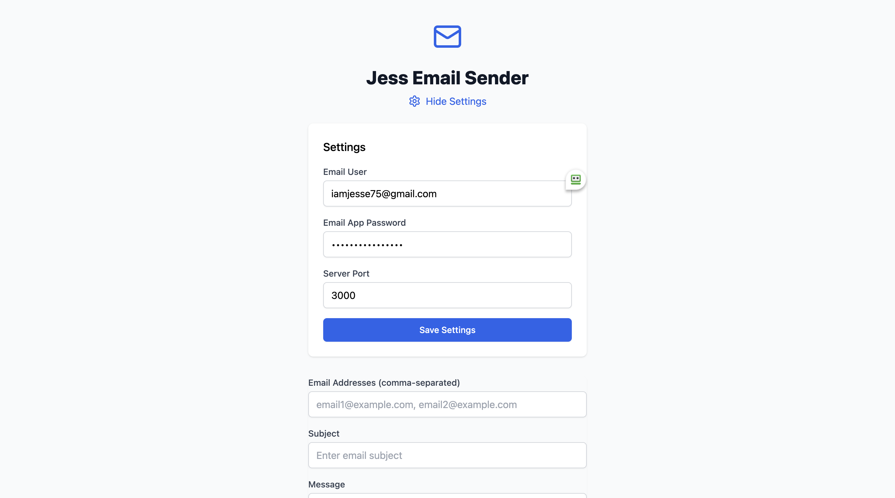

# **Jess Email Sender**  

Jess Email Sender is a simple web-based application that allows users to send emails to multiple recipients using an SMTP server. The app provides an intuitive UI for entering recipient addresses, email subjects, and messages. Additionally, it includes a settings panel for configuring the sender's email credentials.  

## **Features**  
✅ Send emails to multiple recipients  
✅ User-friendly interface  
✅ SMTP authentication with email & app password  
✅ Customizable email subject and message  
✅ Easy configuration of email settings  

## **Screenshots**  

### **Main Interface:**  
![Jess Email Sender - Main]

### **Settings Panel:**  
  

## **How to Use**  
1. Open the application.  
2. Enter recipient email addresses (comma-separated).  
3. Provide the email subject and message.  
4. Configure your email settings (email user, app password, and server port).  
5. Click **Send Emails** to dispatch your message.  

## **Installation & Deployment**  
- Hosted at: [Link to where the app is uploaded]  
- Requires a valid SMTP-enabled email account (e.g., Gmail, Outlook).  

## **Security Notice**  
⚠️ Always use an **app password** instead of your actual email password to enhance security.  
