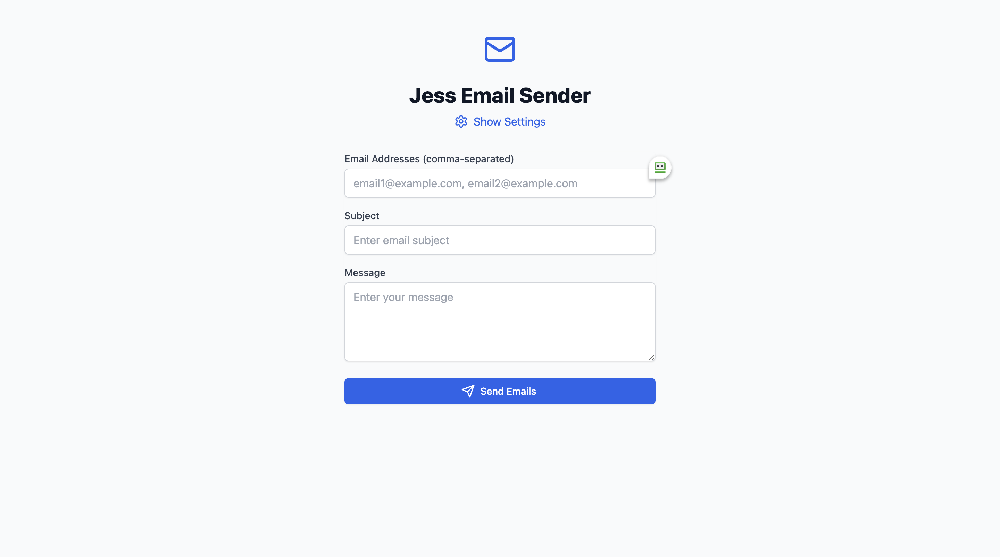

# **Jess Email Sender**  

Jess Email Sender is a simple web-based application that allows users to send emails to multiple recipients using an SMTP server. The app provides an intuitive UI for entering recipient addresses, email subjects, and messages. Additionally, it includes a settings panel for configuring the sender's email credentials.  

## **Features**  
✅ Send emails to multiple recipients  
✅ User-friendly interface  
✅ SMTP authentication with email & app password  
✅ Customizable email subject and message  
✅ Easy configuration of email settings  

## **Screenshots**  

### **Main Interface:**  
![Jess Email Sender - Main]


### **Settings Panel:**  
  

## **How to Use**  
1. Open the application.  
2. Enter recipient email addresses (comma-separated).  
3. Provide the email subject and message.  
4. Configure your email settings (email user, app password, and server port).  
5. Click **Send Emails** to dispatch your message.  

## **Installation & Deployment**  
- Hosted at: #
- Requires a valid SMTP-enabled email account (e.g., Gmail, Outlook).  

## **Local Development Setup**  
To run the project locally, follow these steps:

1. **Clone the repository**  
   ```bash
   git clone https://github.com/janim2/Jesse-Email-Sender
   cd jess-email-sender
   ```

2. **Install dependencies**  
   ```bash
   npm install
   ```

3. **Set up environment variables**  
   Create a `.env` file in the root directory with the following variables:
   ```env
   VITE_API_URL=http://localhost:3000
   ```

4. **Start the development server**  
   ```bash
   npm run dev
   ```

5. **Access the application**  
   Open your browser and navigate to:  
   `http://localhost:5173`

## **Security Notice**  
⚠️ Always use an **app password** instead of your actual email password to enhance security.  
